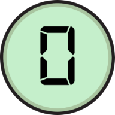
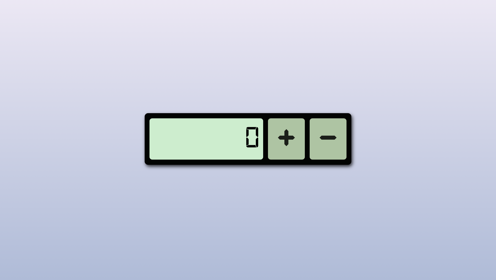

 

  

<h3 align="center">Count it up!</h3>

  

    Comincia a contare, raggiungi gli obiettivi e scopri nuove curiosità!
     
    <a href="https://github.com/rocconmarco"><strong>Repository GitHub »</strong></a>
     
  

<!-- ABOUT THE PROJECT -->
## About The Project

 
 

"Count it up!" è un progetto realizzato nell'ambito del Master in Blockchain Development in collaborazione con start2impact University. Il gioco è composto da un semplice contatore con due pulsanti, "+" per incrementare il conteggio, e "-" per diminuirlo.

 

Ho deciso di rendere il contatore più interessante inserendo vari easter egg in diversi punti del conteggio. Al raggiungimento di un numero contenente un trofeo, comparirà un messaggio con l'icona del premio e una breve descrizione. Tutti i trofei sono collegati a una curiosità sulle tematiche più varie, dalla tecnologia alla cultura generale.

 

Il conteggio funziona in entrambe le direzioni, sia per i numeri positivi che per i numeri negativi. Queste due sezioni costituiscono la "bright side" e la "dark side" del gioco, con i relativi trofei.

 

Al raggiungimento del numero 99999999 per la bright side, e del numero -99999999 per la dark side, comparirà un popup con l'ultimo trofeo e con la possibilità di resettare il conteggio e riprenderlo dalla parte opposta.

(<a href="#readme-top">back to top</a>)

<!-- CONTACT -->
## Contact

<b>Marco Roccon - Digital Innovation & Development</b> 
Portfolio website: https://rocconmarco.github.io/ 
Linkedin: https://www.linkedin.com/in/marcoroccon/ 
GitHub: https://github.com/rocconmarco

Project Link: https://countitup.netlify.app

(<a href="#readme-top">back to top</a>)

## Copyright

© 2024 Marco Roccon. Tutti i diritti riservati.

(<a href="#readme-top">back to top</a>)

